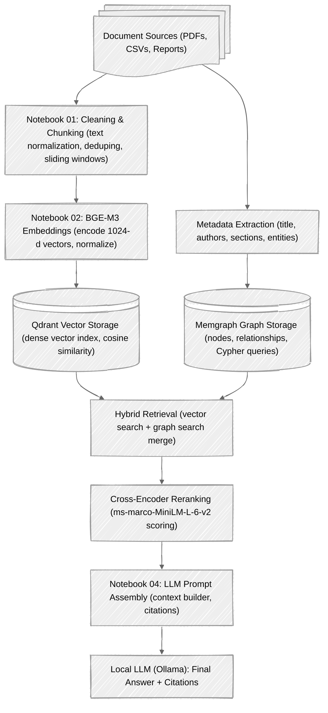

# Advanced Multi-Source RAG System
### Enterprise-Grade Retrieval-Augmented Generation Pipeline  
#### Using BGE-M3 · Qdrant · Memgraph · Ollama

---

## 1. Overview

This project implements a **multi-database, multi-retriever Retrieval-Augmented Generation (RAG) system** designed for **enterprise knowledge workloads**.

It integrates:

- **Document ingestion & normalization**
- **Advanced chunking & cleaning**
- **High-quality BGE-M3 embeddings**
- **Qdrant vector retrieval**
- **Memgraph graph retrieval**
- **Hybrid retriever merging**
- **Cross-encoder reranking**
- **Local LLM (Ollama) with full citations**

Fully modular. Extensible. Enterprise-ready.

---

## 2. System Architecture



---

## 3. Key Components

### 3.1 Text Cleaning & Chunking
- PDF normalization  
- Removal of parsing artifacts  
- Sentence-aware segmentation  
- Sliding windows + overlap  
- Robust deduplication  

### 3.2 Embeddings — BGE-M3
- Model: **BAAI/bge-m3**  
- Produces **1024-dimensional dense embeddings**  
- High multilingual generalization  
- Superior semantic accuracy vs MiniLM/GTE  

### 3.3 Qdrant Vector Database
- Fast ANN search for dense vectors  
- Cosine similarity optimized  
- Stores metadata + embeddings  
- Core semantic retrieval engine  

### 3.4 Memgraph Graph Database
- Stores nodes, relationships, and metadata  
- Cypher query support  
- Adds relational intelligence  
- Complements vector retrieval  

### 3.5 Hybrid Retrieval Pipeline
- Vector search (Qdrant)  
- Graph search (Memgraph)  
- Merge results  
- Cross-encoder reranking  
- Context assembly for LLM  

### 3.6 Local LLM (Ollama)
- Runs models like LLaMA 3, Mistral, Qwen  
- Receives merged context + citations  
- Anti-hallucination prompt framing  
- Produces enterprise-grade answers  

---

## 4. Repository Structure

```
.
├── data/
│   ├── raw_documents/
│   ├── chunks.jsonl
│   └── embeddings.jsonl
│
├── notebooks/
│   ├── Notebook_01_Data_Cleaning_Chunking.ipynb
│   ├── Notebook_02_Embedding_and_Qdrant.ipynb
│   ├── Notebook_03_Hybrid_Retrieval.ipynb
│   ├── Notebook_04_Local_LLM.ipynb
│   └── Notebook_05_Evaluation.ipynb
│
├── docker-compose.yml
├── requirements.txt
└── README.md
```

---

## 5. Running the System

### 5.1 Start Databases

```bash
docker-compose up -d
```

- Qdrant → http://localhost:6333  
- Memgraph Lab → http://localhost:3000  

---

### 5.2 Notebook Workflow

#### **Notebook 01 – Cleaning & Chunking**
- Load PDFs/CSVs  
- Clean extracted text  
- Chunk into windows  

#### **Notebook 02 – Embeddings & Qdrant**
- Generate BGE-M3 embeddings  
- Normalize & store in Qdrant  

#### **Notebook 03 – Hybrid Retrieval**
- Semantic vector search  
- Graph search  
- Reranking with cross-encoder  

#### **Notebook 04 – Local LLM**
- Build final context block  
- Inject citations  
- Produce answer via Ollama  

#### **Notebook 05 – Evaluation**
- Compare retrievers  
- F1 / recall benchmark  

---

## 6. Configuration

### Embedding Model
```bash
export EMBEDDING_MODEL="BAAI/bge-m3"
```

### Reranker Model
```bash
export RERANKER_MODEL="cross-encoder/ms-marco-MiniLM-L-6-v2"
```

### Qdrant Collection
```bash
export QDRANT_COLLECTION="enterprise_docs"
```

---

## 7. Sample Code — Query Embedding

```python
from FlagEmbedding import BGEM3FlagModel
import numpy as np

model = BGEM3FlagModel("BAAI/bge-m3")
vec = model.encode("What does 6G offer?")["dense_vecs"]

# normalize
vec = vec / np.linalg.norm(vec)
```

---

## 8. Future Enhancements
- Multi-vector retrieval (dense + sparse hybrid)  
- Automated metadata extraction  
- Entity linking & ontology building  
- Distributed Qdrant setup  
- Integration with external LLMs (OpenAI, Anthropic, Groq)  
- Scheduled ETL ingestion pipelines  

---

## 9. License
This project is released for educational and research use.  
Check model licenses for commercial applications.

---

<div align="center">
  <p>© 2025 — Advanced Multi-Source RAG Project</p>
</div>
